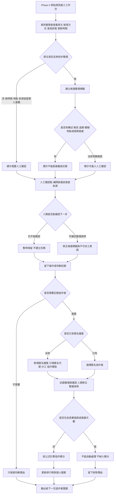

# 資訊流程設計

> 這份文件依照 `release-packs/02-flow-design-kit/` 的方式整理。Mermaid 圖已由 Codex 先產生草稿，仍需要學員用 VS Code 預覽並人工檢查。

## 我的 v1 目標

- 我優先服務的使用者：資訊整理者。
- 這個使用者最想完成的事：把 Phase 0 原始資訊整理成下一位協作者能讀懂的候選整理結果，同時看出來源、查核狀態、缺漏脈絡與不可派工原因。
- 我最想避免的錯誤：把未確認資訊、AI 推測或候選分類誤顯示成已確認任務，讓行動者以為可以直接出發。

## 自然語言流程描述

原始資訊進入工作台後，資訊整理者先查看原文、資訊取得方式、查核狀態與更新時間。工作台可以協助顯示候選整理標籤，但不能替人決定資訊是否為真，也不能判斷是否可以派工。

如果原文缺少時間、地點、來源、當事人意願或現況，就先標示為「需要人工確認」。如果原文包含轉述、截圖、留言、互相矛盾、可能過期、模糊地點或個資疑慮，就標示為「不能直接變成任務」，並保留理由。

只有在人類檢查後，資訊整理者才可以修正候選標籤、補上不可派工原因，或把資料暫時保留給下一位協作者。每一次人工判斷都要留下紀錄，說明誰做了什麼判斷、為什麼這樣判斷，以及還有哪些地方沒有確認。

如果後續需要知道「誰做了哪些整理或確認」，可以使用匿名協作者代號與角色作為操作紀錄的一部分。v1 不把個人檔案做成真實個資，也不依救援次數建立積分排行榜；救援次數不能由這個未確認資訊工作台自動判定，避免讓分數鼓勵使用者把未確認資訊當成任務。

如果畫面需要新增使用者，只能新增匿名協作者檔案。資訊整理者填入匿名代號、分工、協作重點，以及整理與確認、人類修正、暫緩採用三種低風險協作次數。工作台依「整理與確認 x 4 + 人類修正 x 6 + 暫緩採用 x 3」計算協作積分；真實個資與救援次數都不能自動處理，也不能納入排行榜。

## Mermaid 流程圖

請用 VS Code 預覽，確認流程圖能正常顯示。

## 人工確認點

- 原文是否真的足夠整理，或只是看起來完整。
- 轉述者是否等於當事人或現場目擊者。
- 時間是否仍有效，更新時間是否不等於事件發生時間。
- 地點是否足夠清楚，且是否可以公開。
- 資訊是否只能補問或保留，而不能派工。

## 不能自動處理的分支

- 來源是社群貼文、留言、截圖、家屬來電或志工代轉述時，不能自動當成現場確認。
- 原文有互相矛盾的說法時，不能自動選一邊當真。
- 地點模糊或可能涉及個資時，不能自動補成真實地址。
- 出現「不要再派人」「叫大家直接過去」這類行動語句時，不能自動轉成任務或派工建議。
- `needs_review` 或 `unverified` 不能自動改成已確認。
- 新增個人檔案時，如果內容包含真實姓名、電話、地址、可識別個資或救援次數，不能自動納入排行榜。

## 操作或判斷紀錄

- 建立或修改候選整理標籤時，要記錄判斷理由。
- 標示「需要人工確認」時，要記錄缺少哪些資訊。
- 標示「不能直接變成任務」時，要記錄風險原因。
- 人類修正 AI 或工作台建議時，要記錄原本建議、修正後結果與修正理由。
- 暫時不採用某筆資訊時，也要保留理由，避免下一位協作者重複猜測。
- 如果需要個人檔案，只記錄匿名協作者代號、角色與操作內容；不要記錄真實姓名、電話、地址或可識別個資。
- 協作積分公式必須在畫面上看得到：整理與確認 x 4 + 人類修正 x 6 + 暫緩採用 x 3。
- 如果使用者輸入救援次數或真實個資，流程要留下排除理由，而不是把它當成排行榜資料。

## 個人檔案與積分排行榜取捨

- 原始想法：設立個人檔案資料，並依每個人的救援次數多寡給予積分排行榜。
- 本階段決定：v1 不採用救援次數積分排行榜。
- 可保留的部分：用匿名協作者代號記錄誰做了整理、確認或修正，讓下一位協作者知道判斷來源。
- 可以新增匿名個人檔案，但只作為前端工作台中的協作紀錄；不新增後端、資料庫或真實帳號系統。
- 積分算法：整理與確認 x 4 + 人類修正 x 6 + 暫緩採用 x 3。
- 不採用的部分：不依救援次數給分，不排名救援者，不把資訊整理工作台變成行動績效工具。
- 理由：目前資料仍是 Phase 0 原始資訊，多數是 `needs_review` 或 `unverified`。救援次數需要真實任務、現場確認與安全流程支持，不能由這個前端工作台自動判定。

## 我檢查後修正了什麼

- 原本：只判斷「資訊是否足夠」，足夠就建立候選結果。
- 修正後：在建立候選整理標籤後，新增「轉述、衝突、過期、模糊地點或個資疑慮」檢查；有風險時標示為「不能直接變成任務」，並送到人工確認點。
- 為什麼：`release-packs/02-flow-design-kit/docs/design-checklist.md` 要求流程不能把所有輸入都強迫變成候選結果，也不能讓 AI 自動決定資訊是否為真或是否可以派工。

- 原本：使用者提出想新增個人檔案與依救援次數給分的排行榜。
- 修正後：流程只保留匿名協作者操作紀錄，不採用救援次數積分排行榜。
- 為什麼：救援次數屬於真實行動成效，不能由未確認資訊自動推算；排行榜也可能鼓勵為了分數做出不安全行動。

- 原本：流程圖只畫到「記錄匿名代號」，沒有說明如何新增使用者、如何計分，也沒有畫出真實個資或救援次數的阻擋分支。
- 修正後：新增匿名檔案分支、積分公式節點、排行榜更新節點，並加入「真實個資或救援次數不能自動處理」分支。
- 為什麼：`release-packs/02-flow-design-kit/docs/design-checklist.md` 要求流程要有不能自動處理的分支，也要留下操作或判斷紀錄；新增使用者功能同樣要符合這個安全邊界。

## 我仍不確定的流程點

- 候選整理標籤要細到什麼程度，才足夠下一位資訊整理者接手。
- 「不可派工原因」是否需要固定選項，或先保留成文字備註。
- 人工確認紀錄需要記到人名、角色，還是只記錄判斷內容即可。
- 如果後續要服務行動者，哪些欄位必須先被人類確認後才能顯示。
- 如果未來真的需要貢獻統計，應該統計哪些低風險協作行為，而不是救援次數。
- 匿名個人檔案是否需要保存到檔案或後端；目前 v1 仍不做持久化儲存。
